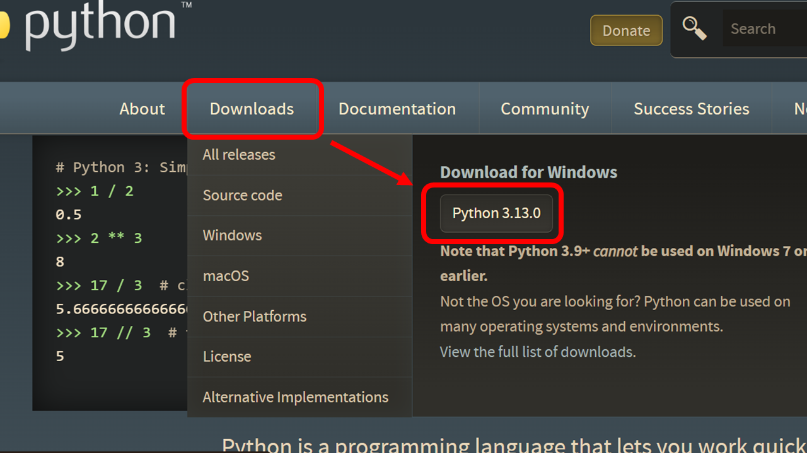

# OSC Langchain のサンプルコード

## 利用方法

- 事前準備

  - ローカル環境に python をインストール
    - [python 公式ページ](https://www.python.org/)にアクセス
    - Downloads にカーソルを合わせボタンを押下するとインストールされる
      
    - 詳細な手順は[コチラ](https://sukkiri.jp/technologies/processors/python/python%E3%81%AE%E3%82%A4%E3%83%B3%E3%82%B9%E3%83%88%E3%83%BC%E3%83%AB%E6%96%B9%E6%B3%95windows%E7%B7%A8.html)
  - venv を作成・起動
    - プロジェクトディレクトリに移動
    ```
    cd [project dir]
    ```
    - 仮想環境を作成（名前は venv にしておく）
    ```
    python3 -m venv venv
    ```
    - 仮想環境を起動
    ```
    .\venv\Scripts\activate
    ```
  - 仮想環境に必要なライブラリをインストール
    ```
    pip install -r requirements.txt
    ```
  - .env ファイルに AzureOpenAI リソースの情報を環境変数として設定
    - AOAI_ENDPOINT:Azure 上で確認
    - AOAI_API_VERSION:[コチラ](https://learn.microsoft.com/ja-jp/azure/ai-services/openai/api-version-deprecation)から確認
    - AOAI_API_KEY:Azure 上で確認
    - AOAI_CHAT_MODEL_NAME:Azure 上で設定したデプロイ名を登録

- 各ファイルの説明
  - XXX.py：XXX 機能のサンプルコード．hogehoge ができる．

## その他情報

- langchain のキャッチアップで参考になった記事
  - https://qiita.com/minorun365/items/081fc560e08f0197a7a8
